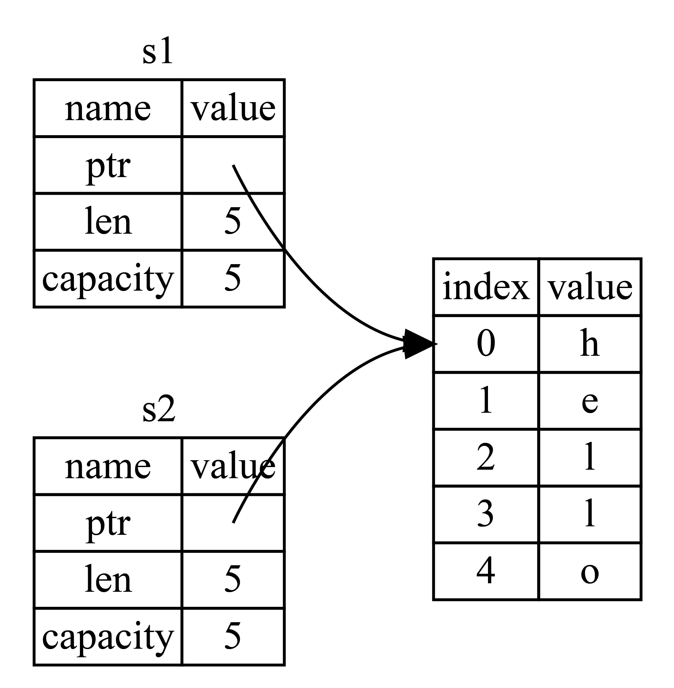

# 所有权

- [所有权](#所有权)
  - [简介](#简介)
  - [堆和栈](#堆和栈)
    - [栈](#栈)
    - [堆](#堆)
    - [性能差异](#性能差异)
  - [所有权规则](#所有权规则)
    - [变量作用域](#变量作用域)
    - [String 类型](#string-类型)
  - [内存和分配](#内存和分配)
    - [变量和数据交互：Move](#变量和数据交互move)
    - [变量和数据交互：Clone](#变量和数据交互clone)
    - [Stack 数据：Copy](#stack-数据copy)
  - [所有权和函数](#所有权和函数)
  - [返回值和 Scope](#返回值和-scope)
  - [更多示例](#更多示例)

2023-10-18, 08:52
update: 简化描述
add: 更多示例
2023-10-10, 19:49
@author Jiawei Mao
****

## 简介

Rust 之所以能成为万众瞩目的语言，就是因为其内存安全性。以往内存安全几乎都是通过 GC 实现，但是 GC 会引来性能、内存占用等问题，在高性能场景和系统编程上不可接受，因此 Rust 采用了与众不同的方式：**所有权系统**。

所有的程序都必须和计算机内存打交道，如何从内存中申请空间来存放程序的运行内容，如何在不需要的时候释放这些空间，成了重中之重，这也是所有编程语言设计的难点之一。在计算机语言不断演变的过程中出现了三种流派：

- 垃圾回收机制（GC），在程序运行时不断寻找不再使用的内存，典型代表：Java、Go。
- 手动管理内存的分配和释放，在程序中，通过函数调用的方式来申请和释放内存，典型代表：C++。
- 通过所有权来管理内存，编译器在编译时会根据一系列规则进行检查

Rust 选择了第三种，最妙的是，这种检查只发生在编译期，因此对程序运行不会有任何性能损失。下面讨论所有权（ownership）的几个概念：

- 借用
- 切片
- Rust 如何在内存中布局数据

## 堆和栈

许多编程语言不需要考虑堆和栈，但像 Rust 这样的系统编程语言，数据在堆还是栈上会影响语言的行为。

堆（heap）和栈（stack）都是为程序提供运行时所需的内存空间，但是它们的结构不同。

### 栈

栈按获取值的顺序存储值，按相反的顺序删除值，即**后进先出**。

增加数据叫**进栈**，移除数据叫**出栈**。

栈的存取方式要求数据的大小必须已知且固定，在编译时大小未知或大小可变的数据只能存储在堆中。

### 堆

堆相对无序：将数据存放到堆上，需要请求一定大小的内存。系统在堆中找到一块足够大的空间，将其标记为已使用，并返回一个指向该位置地址的指针，这个过程称为**在堆上分配内存**，简称分配 （allocating）。

因为指向堆的指针是已知的固定大小，因此指针会压入栈中。在后续使用中，将通过栈中的指针，来获取数据在堆上的实际内存地址，进而访问该数据。

### 性能差异

**写入数据**：入栈比在堆上分配内存要快，因为入栈时操作系统无需分配新的空间，只需将新数据放入栈顶部即可。而在堆上，内存 allocator 需要先找到一块足够存储数据的内存空间。

**读取数据**：栈数据往往可以直接存储在 CPU 告诉缓存上，而堆数据只能存储在内存。访问堆上的数据比访问栈上的数据慢，因为必须先访问栈，再通过栈上的指针来访问堆。

当代码调用函数时，传递给函数的值（包括可能指向堆中数据的指针）和函数的局部变量被压入栈。函数结束时，这些值从栈中弹出。

跟踪代码中哪部分正在使用堆中哪些数据，最小化堆上重复数据，以及清理堆上未使用的数据，这些都是所有权可以解决的问题。理解所有权后，就不需要经常考虑栈和堆。

## 所有权规则

所有权规则：

1. Rust 中每个值都被一个变量拥有，该变量被称为值的**所有者**（owner）
2. 一个值一次只能有一个 owner。
3. 当 owner 离开作用域范围，owner 拥有的值被删除（drop）。

### 变量作用域

**作用域**是变量在程序中有效的范围。例如，定义一个变量：

```rust
let s = "hello";
```

变量 `s` 绑定到一个字符串字面量，从声明的地方到当前 scope 结束 `s` 有效。如下：

```rust
{                      // s 在这里无效，尚未声明
    let s = "hello";   // 从此处起，s 有效

    // do stuff with s
}                      // 作用域结束，s 无效
```

简而言之：

- `s` 从创建时开始有效
- 在超出当前作用域之前 `s` 一直有效

Rust 作用域和其它编程语言一样。

### String 类型

为了解释所有权的规则，下面介绍字符串。字符串类型 `String` 是一个比基本类型更复杂的数据类型。

前面介绍的类型大小是已知的，可以存储在 stack 中，当它们的 scope 结束时从 stack 弹出，如果其它代码需要在不同 scope 使用相同的值，也可以快速复制一个新的、独立的实例。

我们主要关心 heap 上的数据，并探索 Rust 如何清理 heap 上的数据，`String` 类型是一个很好的例子。对 `String` 的所有权相关概念，也适用于其他复杂类型。

签名介绍的字符串字面值 `let s ="hello"`， `s` 是被硬编码进程序里的字符串值（类型为 `&str`）。字符串字面值是很方便的，但是它功能有限：

- **字符串字面值不可变**，被硬编码到程序代码中
- 并非所有字符串的值都能在编写代码时得知

为此，Rust 提供动态字符串类型 `String`，其数据存储在堆上，可以动态伸缩，所以能存储在编译时大小未知的文本。

**示例：** 使用 `String.from` 函数从字符串字面量创建 `String`

```rust
let s = String::from("hello");
```

这类字符不像字符串字面量，可以被修改：

```rust
let mut s = String::from("hello");

s.push_str(", world!"); // push_str() 在字符串后面追加字面量

println!("{}", s); // 打印 `hello, world!`
```

## 内存和分配

对字符串字面量，在编译时就知道内容，即直接硬编码到最终的可执行文件中。

`String` 类型为了支持可变的、可增长的，需要在 heap 上分配一定数量的内存，在编译时未知。因此：

- 必须在运行时从 allocator 请求内存
- 使用完 `String`，需要一种方法将这些内存还给 allocator

第一部分由我们自己完成，当我们调用 `String::from`，其实现会请求所需的内存，在编程语言中普遍如此。

第二部分就不同了。在具有垃圾回收器（GC）的语言中，GC 会跟踪并清理不再使用的内存；在没有 GC 的语言中，需要程序员手动释放内存，而正确释放内存很困难。

Rust 采用不同的方式：当变量超出 scope，就自动返还内存。例如:

```rust
{
    let s = String::from("hello"); // s is valid from this point forward

    // do stuff with s
}                         // this scope is now over, and s is no longer valid
```

当 `s` 超出 scope，是释放 `String` 占有的内存给 allocator 最佳时刻。当变量超出 scope，Rust 会自动调用一个特殊的 `drop` 函数。

!!! note
    在 C++ 中，这种在生命周期结束释放资源的模式称为 Resource Acquisition Is Initialization (RAII)。如果使用过 RAII，就会很熟悉 drop 函数。

这种模式对 Rust 代码的编写方式影响很大。此时看起来很简单，但是在更复杂的情况，当我们想让多个变量使用分配到  heap 上的数据时，代码的行为可能会出乎意料。

### 变量和数据交互：Move

在 Rust 中，多个变量可以用不同的方式与相同的数据交互。例如：

```rust
let x = 5;
let y = x;
```

这里，将 `5` 绑定到 x；然后复制 x 的值，并将其绑定到 `y`。此时变量 x 和 y 的值都是 5。因为整数是固定大小、已知的简单值，因此这两个 `5` 被压入 stack。因为栈上的数据简单，所以拷贝速度比在堆上创建内存快得多。

再来看 **String 版本**：

```rust
let s1 = String::from("hello");
let s2 = s1;
```

虽然代码看起来一样，但行为完全不同。对基本类型（存储在栈上），Rust 会自动拷贝，但 `String` 不是基本类型，而是存储在堆上，不会自动拷贝。

如下图所示：

{width="360px"}

> 图 1：字符串在内存中的表示

`String` 是一个复杂的类型，由三部分组成：

- 指向内存的指针
- 字符串长度
- 字符串容量

这部分信息存储在栈中，而右边内容保存在堆上。

**只复制 String 本身**

将 s1 赋值给 s2 时，`String` 的数据被复制，即复制栈上的指针、length 和 capacity，不会复制指针指向的堆上的数据。此时内存中的数据如图所示：

{width="360px"}

> 图 2：字符 `s1` 的副本 `s2` 在内存中的表示。

在 64 位机器上等于拷贝了 8字节指针+8字节长度+8字节容量=24字节。

**同时复制堆上的数据**

如下所示：

@import "images/trpl04-03.png" {width="360px" title=""}

> 图 3：如果同时复制 heap 数据，`s2 = s1` 的内存表示。

如果堆上的数据很大，复制堆数据会使 `s2 = s1` 操作在运行时性能就会很差。

当变量超出 scope，Rust 会自动调用 `drop` 函数清理该变量指向的堆内存。如图 2 所示，两个指针指向相同位置。此时有个问题：当 s2 和 s1 超出 scope，它们都会尝试释放相同的内存，这被称为 *double free* error。两次释放内存可能导致内存损坏，从而导致安全漏洞。

**Rust 对该问题的解决方案**：在 `let s2 = s1;` 后，Rust 认为 `s1` 失效。因此当 s1 超出 scope，Rust 不需要释放任何东西。下面看看创建 s2 后，继续使用 s1 会有什么效果：

```rust
let s1 = String::from("hello");
let s2 = s1;

println!("{}, world!", s1);
```

运行会报错：

```sh
$ cargo run
   Compiling ownership v0.1.0 (file:///projects/ownership)
error[E0382]: borrow of moved value: `s1`
 --> src/main.rs:5:28
  |
2 |     let s1 = String::from("hello");
  |         -- move occurs because `s1` has type `String`, which does not implement the `Copy` trait
3 |     let s2 = s1;
  |              -- value moved here
4 |
5 |     println!("{}, world!", s1);
  |                            ^^ value borrowed here after move
  |
  = note: this error originates in the macro `$crate::format_args_nl` which comes from the expansion of the macro `println` (in Nightly builds, run with -Z macro-backtrace for more info)
help: consider cloning the value if the performance cost is acceptable
  |
3 |     let s2 = s1.clone();
  |                ++++++++

For more information about this error, try `rustc --explain E0382`.
error: could not compile `ownership` due to previous error
```

Rust 这种行为和浅复制有点类似，但是 Rust 直接使第一个变量失效，该行为在 Rust 中称为移动（move）。对该示例，我们可以说 s1 移到了 s2.因此，实际的情况是：

@import "images/trpl04-04.png" {width="360px" title=""}

> 图 4：s1 失效后的内存表示。

这样问题就解决了，当 s2 超出 scope，它会单独释放内存。

该设计也说明 Rust 不会自动创建数据的**深副本**。因此，在运行时任何自动复制都是廉价高效的。

### 变量和数据交互：Clone

如果需要深度复制字符串的 heap 数据，而不仅仅是 stack 数据，可以使用 `clone` 方法。

示例：

```rust
let s1 = String::from("hello");
let s2 = s1.clone();

println!("s1 = {}, s2 = {}", s1, s2);
```

这样会显式产生图 3 的效果，即复制 heap 数据。

深度复制操作比较昂贵。如果代码性能不重要，如初始化程序时，或者在某段时间只执行一次，可以使用 `clone` 来简化编程；但对于执行较为频繁的代码，使用 `clone` 会极大降低程序性能，需要小心使用。

### Stack 数据：Copy

对整数，如下所示：

```rust
let x = 5;
let y = x;

println!("x = {}, y = {}", x, y);
```

虽然没有调用 clone，但 x 依然有效。该操作称为浅拷贝，因为只发生在栈上，性能高，在日常编程中无处不在。

原因在于，像整数这种编译时占用内存已知的类型存储在栈上，因此可以快速复制。因此没有理由在创建变量 `y` 后使 `x` 失效。换言之，这里深复制和浅复制没有区别，调用 `clone` 也不会做任何与浅复制不同的事情。

**添加浅复制实现**

Rust 有一个名为 `Copy` 的 trait，可以将其放在存储在 stack 的类型上，如 integer。如果一个类型实现了 `Copy` trait，其对应变量不会 move，而是复制，使它们在复制给另一个变量后仍然有效。

如果类型或其任何部分实现了 `Drop` trait，则不允许使用 Copy 注释该类型，否则抛出编译错误。

那么，哪些类型实现了 `Copy` trait？一般来说，简单的标量值都可以实现 Copy，下面是一些实现 Copy 的类型：

- 所有整数类型，如 i32
- 布尔类型 bool
- 浮点类型，如 f64
- 字符类型 char
- 只包含实现 `Copy` 类型的 Tuple，如 `(i32, i32)` 实现了 `Copy`，但是 `(i32, String)` 没有

## 所有权和函数

向函数传递值的机制与给变量赋值的机制类似，也有**移动**和**复制**两种情况。示例：

```rust
fn main() {
    let s = String::from("hello");  // s 进入 scope

    takes_ownership(s);  // s 的值 move 到函数，因此 s 失效

    let x = 5;           // x 进入 scope

    makes_copy(x);       // x move 到函数，但是 i32 被复制，所以后面 x 依然有效
} // 这里，x 和 s 超出 scope，但是 s 的值已经 move，所以不会发生什么

fn takes_ownership(some_string: String) { // some_string comes into scope
    println!("{}", some_string);
} // 这里 some_string 超出 scope，`drop` 被调用，释放内存

fn makes_copy(some_integer: i32) { // some_integer 进入 scope
    println!("{}", some_integer);
} // Here, some_integer 超出 scope，但没有特殊操作
```

在调用 `takes_ownership` 后再使用 s，Rust 会抛出编译时错误。

## 返回值和 Scope

返回值可以转移 ownership。示例：

```rust
fn main() {
    let s1 = gives_ownership(); // gives_ownership 将返回值移到 s1

    let s2 = String::from("hello");   // s2 进入 scope

    let s3 = takes_and_gives_back(s2); // s2 move 到 takes_and_gives_back, 
                                       // 该函数返回值 move 到 s3
} // s3 超出 scope 被删除，s2 已经 move，s1 超出 scope 被删除

fn gives_ownership() -> String {   // gives_ownership 将其返回值 move 到调用函数

    let some_string = String::from("yours"); // some_string 进入 scope

    some_string    // 返回 some_string，并 move 到外部调用函数
}

// This function takes a String and returns one
fn takes_and_gives_back(a_string: String) -> String { // a_string 进入 scope
    a_string  // 返回 a_string 并 move 给调用函数
}
```

变量的 ownership 每次都遵循相同模式：将一个值赋给另一个变量会 move 它。包含 heap 数据的变量超出 scope 时，该变量的值被 drop 删除，除非数据的 ownership 已经转移到另一个变量。

每个函数都获取 ownership 然后返回 ownership 有点繁琐。如果想让一个函数使用一个值但不拥有 ownership 呢？除了函数中我们想返回的数据，我们传入的参数也需要传递回来。

Rust 通过 tuple 可以返回多个值。例如：

```rust
fn main() {
    let s1 = String::from("hello");

    let (s2, len) = calculate_length(s1);

    println!("The length of '{}' is {}.", s2, len);
}

fn calculate_length(s: String) -> (String, usize) {
    let length = s.len(); // len() returns the length of a String

    (s, length)
}
```

所有权避免了内存的不安全性，但是总是把值传来传去，太麻烦了。幸运的是，Rust 有一个特性可以在不转移所有权的情况下使用值，称为**引用**（reference）。

## 更多示例

- 使用尽可能多的方法来通过编译

```rust
fn main() {  
    let x = String::from("hello, world");
    let y = x;
    println!("{},{}",x,y);
}
```

方式一：将 x 修改为字面量

```rust
fn main() {
    let x = "hello, world";
    let y = x;
    println!("{},{}", x, y);
}
```

方式二：调用 x.clone 生成 y

```rust
fn main() {
    let x = String::from("hello, world");
    let y = x.clone();
    println!("{},{}", x, y);
}
```

方式三：将 x 设为引用类型

```rust
fn main() {
    let x = &String::from("hello, world");
    let y = x;
    println!("{},{}", x, y);
}
```

方式四：调用 `as_str()` 生成整个 `String` 的切片

```rust
fn main() {
    let x = String::from("hello, world");
    let y = x.as_str();
    println!("{},{}", x, y);
}
```

- 修复错误，不要删除任何代码行

```rust
fn main() {
    let s = String::from("hello, world");

    print_str(s);

    println!("{}", s);
}

fn print_str(s: String)  {
    println!("{}",s)
}
```

方式一：调用 clone

```rust
fn main() {
    let s = String::from("hello, world");

    print_str(s.clone());

    println!("{}", s);
}

fn print_str(s: String)  {
    println!("{}",s)
}
```

方式二：传入引用

```rust
 fn main() {
     let s = String::from("hello, world");
     print_str(&s);
     println!("{}", s);
 }

 fn print_str(s: &String)  {
     println!("{}",s)
 }
```

- 不要使用 clone，使用 copy 的方式替代

```rust
fn main() {
    let x = (1, 2, (), "hello".to_string());
    let y = x.clone();
    println!("{:?}, {:?}", x, y);
}
```

这里元组 `x` 里面除了 `"hello".to_string()`，其它都是在堆栈上的基本类型，所以修改方式：

```rust
fn main() {
    let x = (1, 2, (), "hello");
    let y = x;
    println!("{:?}, {:?}", x, y);
}
```
