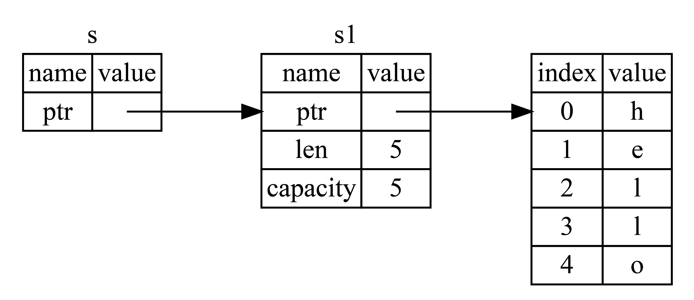

# 引用和借用

- [引用和借用](#引用和借用)
  - [简介](#简介)
  - [引用和解引用](#引用和解引用)
  - [不可变引用](#不可变引用)
  - [可变引用](#可变引用)
    - [可变引用只能同时有一个](#可变引用只能同时有一个)
    - [可变引用和不可变引用不能同时存在](#可变引用和不可变引用不能同时存在)
    - [NLL](#nll)
  - [悬空引用](#悬空引用)
  - [ref](#ref)
  - [借用规则总结](#借用规则总结)
  - [更多示例](#更多示例)

2023-10-18, 14:12
add: ref, 更多示例
update: 细化内容
2023-10-11, 11:19
@author Jiawei Mao
****

## 简介

仅仅通过转移所有权的方式获取值，会让程序变得很复杂。Rust 通过变量引用来解决该问题，获取引用的操作称为**借用**。

## 引用和解引用

常规引用类似一个指针，指向对象存储的内存地址。例如，创建一个 i32 值的引用 `y`，然后用解引用运算符获得 `y` 引用的值：

```rust
fn main() {
    let x = 5;
    let y = &x;

    assert_eq!(5, x);
    assert_eq!(5, *y);
}
```

变量 `x` 存放 `i32` 值 `5`，`y` 是 `x` 的引用。可以直接对 `x` 断言，但要断言 y 的值，必须使用 `*y` 解出引用所指向的值，也就是**解引用**。直接使用 `assert_eq!(5, y);` 会得到编译错误。

## 不可变引用

**示例：** 用引用定义函数参数

这里将 `s1` 的引用作为参数传递给 `calculate_length`，而不是把 `s1` 的所有权转移给函数：

```rust
fn main() {
    let s1 = String::from("hello");

    let len = calculate_length(&s1);

    println!("The length of '{}' is {}.", s1, len);
}

fn calculate_length(s: &String) -> usize {
    s.len()
}
```

要点有二：

- 无需先通过函数参数传入所有权，然后再通过函数返回传入的所有权，代码更加简介
- `calculate_length` 的参数类型从 `String` 变为 `&String`

这里 `&` 表示引用。引用使用值但不需要所有权。图示：

{width="450px"}

> 图 5：指向 `String s1` 的引用 `&String s`

对函数调用：

```rust
let s1 = String::from("hello");

let len = calculate_length(&s1);
```

`&s1` 创建一个指向 `s1` 的引用，但不拥有它。因为没有所有权，所以引用离开 scope 后，它指向的值也不会被删除。

同理，函数签名使用 `&` 来表示形参 `s` 是引用：

```rust
fn calculate_length(s: &String) -> usize { // s 是对 String 的引用
    s.len()
} // s 超出 scope，但是因为它不拥有引用值的所有权，所以不会删除其指向的内容
```

- **通过引用修改变量值**

那么，如果我想通过引用修改借用变量的值呢？答案是，不行：

```rust
fn main() {
    let s = String::from("hello");

    change(&s);
}

fn change(some_string: &String) {
    some_string.push_str(", world");
}
```

抛出错误：

```sh
$ cargo run
   Compiling ownership v0.1.0 (file:///projects/ownership)
error[E0596]: cannot borrow `*some_string` as mutable, as it is behind a `&` reference
 --> src/main.rs:8:5
  |
7 | fn change(some_string: &String) {
  |                        ------- help: consider changing this to be a mutable reference: `&mut String`
8 |     some_string.push_str(", world");
  |     ^^^^^^^^^^^^^^^^^^^^^^^^^^^^^^^ `some_string` is a `&` reference, so the data it refers to cannot be borrowed as mutable

For more information about this error, try `rustc --explain E0596`.
error: could not compile `ownership` due to previous error
```

正如变量默认 immutable，引用也是。那么，如何解决？往下看。

## 可变引用

将函数参数修改为 `mut` 引用，就能够修改借用的值：

```rust
fn main() {
    let mut s = String::from("hello");

    change(&mut s);
}

fn change(some_string: &mut String) {
    some_string.push_str(", world");
}
```

这里的修改包括：

- 把 `s` 设为 `mut`
- 调用 `change` 函时使用 `&mut s` 创建可变引用
- 更新函数签名 `some_string: &mut String` 接收一个可变引用参数

### 可变引用只能同时有一个

可变引用有一个很大的限制：**同一个 scope，特定数据只能有一个可变引用**。

**示例：** 尝试创建 2 个可变引用

```rust
let mut s = String::from("hello");

let r1 = &mut s;
let r2 = &mut s;

println!("{}, {}", r1, r2);
```

抛出错误：

```sh
$ cargo run
   Compiling ownership v0.1.0 (file:///projects/ownership)
error[E0499]: cannot borrow `s` as mutable more than once at a time
 --> src/main.rs:5:14
  |
4 |     let r1 = &mut s;
  |              ------ first mutable borrow occurs here
5 |     let r2 = &mut s;
  |              ^^^^^^ second mutable borrow occurs here
6 |
7 |     println!("{}, {}", r1, r2);
  |                        -- first borrow later used here
```

这个错误告诉我们不能多次借用可变变量：

- 第一个可变引用 `r1` 持续到 `println!`
- 在 `r1` 创建到最后一次使用之间，尝试创建第二个可变引用 `r2`

对新手来说，对这个特性会感觉非常难受。

该限制的好处是 Rust 在编译时就能避免数据竞争。满足以下三个条件出现数据竞争：

- 两个或多个指针同时访问相同的数据
- 至少有一个指针正在写入数据
- 没有使用同步机制控制对数据的访问

数据竞争会导致结果不确定，这类错误难以诊断和修复；Rust 在编译时拒绝带有数据竞争的代码以防止这种问题。

**用大括号绕过该问题**

使用大括号创建一个新的 scope 限制变量作用域：

```rust
let mut s = String::from("hello");

{
    let r1 = &mut s;
} // r1 离开 scope，所以后面可以创建新的引用

let r2 = &mut s;
```

### 可变引用和不可变引用不能同时存在

组合使用 mutable 和 immutable 引用会报错：

```rust
let mut s = String::from("hello");

let r1 = &s; // 没问题
let r2 = &s; // 没问题
let r3 = &mut s; // 大问题

println!("{}, {}, and {}", r1, r2, r3);
```

错误信息：

```
$ cargo run
   Compiling ownership v0.1.0 (file:///projects/ownership)
error[E0502]: cannot borrow `s` as mutable because it is also borrowed as immutable
 --> src/main.rs:6:14
  |
4 |     let r1 = &s; // no problem
  |              -- immutable borrow occurs here
5 |     let r2 = &s; // no problem
6 |     let r3 = &mut s; // BIG PROBLEM
  |              ^^^^^^ mutable borrow occurs here
7 |
8 |     println!("{}, {}, and {}", r1, r2, r3);
  |                                -- immutable borrow later used here
```

这个限制很好理解：借用 immutable 引用的用户，肯定不希望他借用的东西被其它人修改。多个 immutable 引用没问题，因为没人去修改数据。

!!! attention
    引用 s 的作用域从创建开始，到最后一次使用的地方结束；而变量的作用域从创建开始，持续到花括号结束。

例如，下面的代码可以编译，因为最后一次使用 immutable 引用 println! 在引入 mutable 引用之前：

```rust
fn main() {
    let mut s = String::from("hello");
    let r1 = &s;
    let r2 = &s;
    println!("{} and {}", r1, r2);
    // 新编译器中，r1,r2作用域在这里结束
    let r3 = &mut s;
    println!("{}", r3);
} // 老编译器中，r1、r2、r3作用域在这里结束
  // 新编译器中，r3作用域在这里结束
```

在老版本的编译器中（Rust 1.31 前），将会报错，因为 r1 和 r2 的作用域在花括号 `}` 处结束，那
么 r3 的借用就会触发 **无法同时借用可变和不可变引用** 的规则。

但是在新的编译器中，该代码将顺利通过，因为 **引用作用域的结束位置从花括号变成最后一次使用的
位置**，因此 r1 借用和 r2 借用在 println! 后，就结束了，此时 r3 可以顺利借用到可变引用。

### NLL

对于这种编译器优化行为，Rust 专门起了一个名字 —— **Non-Lexical Lifetimes(NLL)**，专门用于找到某个引用在作用域( `}` )结束前就不再被使用的代码位置。

虽然这种借用错误有的时候会让我们很郁闷，但是你只要想想这是 Rust 提前帮你发现了潜在的 BUG，其实就开心了，虽然减慢了开发速度，但是从长期来看，大幅减少了后续开发和运维成本。

## 悬空引用

悬空引用也叫做**悬空指针**，表示指针指向某个值，这个值被释放掉了，而指针仍然存在，其指向的内存可能不存在任何值或已被其它变量重新使用。

Rust 编译器可以确保引用永远也不会变成悬空状态：当你获取数据的引用后，编译器可以确保数据不会在引用结束前被释放，要想释放数据，必须先停止其引用的使用。

**示例：** 创建悬空引用看看 Rust 的编译错误

```rust
fn main() {
    let reference_to_nothing = dangle();
}

fn dangle() -> &String {
    let s = String::from("hello");

    &s
}
```

编译错误：

```sh
$ cargo run
   Compiling ownership v0.1.0 (file:///projects/ownership)
error[E0106]: missing lifetime specifier
 --> src/main.rs:5:16
  |
5 | fn dangle() -> &String {
  |                ^ expected named lifetime parameter
  |
  = help: this function's return type contains a borrowed value, but there is no value for it to be borrowed from
help: consider using the `'static` lifetime
  |
5 | fn dangle() -> &'static String {
  |                 +++++++
```

该错误引入了**生命周期**的概念，暂时忽略，只看 help 后的信息：

```
this function's return type contains a borrowed value, but there is no value
for it to be borrowed from
```

代码即使：

```rust
fn dangle() -> &String { // dangle 返回字符串的引用

    let s = String::from("hello"); // s 是一个新 String

    &s // 返回 String s 的引用
} // s 超出 scope 被删除，其内存被释放
  // 危险！
```

因为 `s` 是在 `dangle` 函数内创建的，所以当 `dangle` 的代码执行完，s 的内存被释放。但是此时我们视图返回它的引用，导致引用指向一个无效的 `String`。Rust 不会让这种事发生。

**解决方法：** 直接返回字符串，不要返回引用

```rust
fn no_dangle() -> String {
    let s = String::from("hello");

    s
}
```

所有权通过返回值转移，不会释放内容。

## ref

`ref` 与 `&` 类似，可以用来获取一个值的引用，但是它们的用法有所不同。

```rust
fn main() {
    let c = '中';

    let r1 = &c;
    // 使用 ref 获取引用
    let ref r2 = c;

    assert_eq!(*r1, *r2);

    // 两个内存地址相同
    assert_eq!(get_addr(r1), get_addr(r2));
}

// 获取传入引用的内存地址的字符串形式
fn get_addr(r: &char) -> String {
    format!("{:p}", r)
}
```

## 借用规则总结

借用的基本规则：

- 同一时刻，可以拥有一个可变引用，或多个可不变引用
- 引用必须始终有效

## 更多示例

- 获取变量内存地址

```rust
fn main() {
    let x = 5;
    // 通过引用 &x 获得地址
    let p = &x;

    println!("x 的内存地址是 {:p}", p); // output: 0x16fa3ac84
}
```

- 获取引用值

```rust
fn main() {
    let x = 5;
    let y = &x;

    // 使用 *y 获得 y 引用的值
    assert_eq!(5, *y);
}
```

- 参数类型错误

```rust
// 修复错误
fn main() {
    let mut s = String::from("hello, ");

    borrow_object(s)
}

fn borrow_object(s: &String) {}
```

`borrow_object` 需要字符串引用 &String，传入的却是 `String`，修改方式：

```rust
fn main() {
    let mut s = String::from("hello, ");

    borrow_object(&s) // 这里把参数修改为 &s
}

fn borrow_object(s: &String) {}
```

- 通过引用修改值

```rust
fn main() {
    let mut s = String::from("hello, ");

    // 可变引用
    let p = &mut s;

    p.push_str("world");
}
```

- 允许从可用对象借用不可变

```rust
fn main() {
    let mut s = String::from("hello, "); // 可变对象

    borrow_object(&s); // 不可变引用
    
    s.push_str("world");
}

fn borrow_object(s: &String) {}
```
