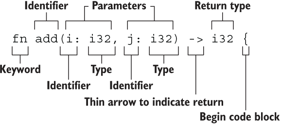

# Rust 函数

- [Rust 函数](#rust-函数)
  - [1. 简介](#1-简介)
  - [2. 参数](#2-参数)
  - [3. 返回值](#3-返回值)
    - [3.1. 无返回值](#31-无返回值)
    - [3.2. 发散函数](#32-发散函数)

2023-10-17, 14:39
add: 发散函数
2023-10-10, 10:07
@author Jiawei Mao
****

## 1. 简介

下面是 `add` 函数：

```rust
fn add(i: i32, j: i32) -> i32 {
   i + j
}
```

其结构为：

- 以关键字 `fn` 开始
- 函数名
- 圆括号包含参数
- 大括号表示方法体


{width="360px"}

要点：

- 函数名和变量使用蛇形命名法，即所有函数和变量名都是小写，多个单词以下划线分开。
- 函数可以随便放，Rust 不关心在哪里定义函数
- 每个函数参数都需要标注类型

## 2. 参数

定义函数可以包含形参（parameters）：

- **形参**是函数签名中的特殊变量。
- 当函数有形参时，调用它时可以提供具体的值，具体的值称为**实参**（arguments）。
- 在日常交流中，形参和实参往往互换使用。
- Rust 是强类型语言，定义函数参数时需要标注类型

例如，为 `another_function` 添加一个参数：

```rust
fn main() {
    another_function(5);
}

fn another_function(x: i32) {
    println!("The value of x is: {x}");
}
```

运行程序：

```sh
$ cargo run
    Finished dev [unoptimized + debuginfo] target(s) in 0.03s
     Running `target\debug\variables.exe`
The value of x is: 5
```

在函数签名中，必须声明参数类型。多个参数以逗号隔开，例如：

```rust
fn main() {
    print_labeled_measurement(5, 'h');
}

fn print_labeled_measurement(value: i32, unit_label: char) {
    println!("The measurement is: {value}{unit_label}");
}
```

## 3. 返回值

Rust 函数就是表达式，能够返回值。在箭头后面声明返回类型。

在 Rust 中，函数的返回值就是最后一条表达式的值。也可以使用 `return` 关键字提前从函数返回，不过大多数函数隐式返回最后一个表达式的值。例如：

```rust
fn plus_five(x:i32) -> i32 {
    x + 5
}

fn main() {
    let x = plus_five(5);
    println!("The value of x is: {}", x);
}
```

`x + 5` 是最后一条表达式，计算后返回一个值。

**示例：** 同时使用表达式和 `return`

```rust
fn plus_or_minus(x:i32) -> i32 {
    if x > 5 {
        return x - 5
    }

    x + 5
}

fn main() {
    let x = plus_or_minus(5);

    println!("The value of x is: {}", x);
}
```

### 3.1. 无返回值

单元类型 `()` 是一个零长度元组，可以用来表示一个函数没有返回值：

- 函数没有返回值，则返回 `()`
- 以 `;` 结尾的表达式返回 `()`

**示例：** 隐式返回 `()`

```rust
use std::fmt::Debug;

fn report<T: Debug>(item: T) {
  println!("{:?}", item);
}
```

**示例：** 显式返回 `()`

```rust
fn clear(text: &mut String) -> () {
  *text = String::from("");
}
```

在实际编程中经常会在错误提示中看到 `()`，假如你的函数需要返回一个 `u32` 值，但是函数的最后一行为 `表达式;` 形式，就会报错：

```rust
fn add(x:u32,y:u32) -> u32 {
    x + y;
}
```

```
error[E0308]: mismatched types // 类型不匹配
 --> src/main.rs:6:24
  |
6 | fn add(x:u32,y:u32) -> u32 {
  |    ---                 ^^^ expected `u32`, found `()` // 期望返回u32,却返回()
  |    |
  |    implicitly returns `()` as its body has no tail or `return` expression
7 |     x + y;
  |          - help: consider removing this semicolon
```

只有表达式能返回值，而以 `;` 结尾的是语句。

在 Rust 中必须**严格区分表达式和语句**。

### 3.2. 发散函数

用 `!` 作为函数返回类型，表示函数永不返回。

这种语法往往用做会导致程序崩溃的函数：

```rust
fn dead_end() -> ! {
  panic!("你已经到了穷途末路，崩溃吧！");
}
```

下面的函数创建了一个无限循环，该循环永不跳出，因此函数也永不返回：

```rust
fn forever() -> ! {
  loop {
    //...
  };
}
```
