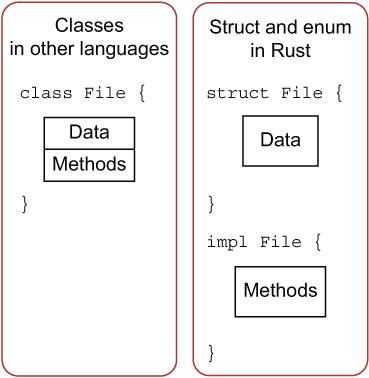

# 方法

- [方法](#方法)
  - [简介](#简介)
  - [定义方法](#定义方法)
    - [self, \&self 和 \&mut self](#self-self-和-mut-self)
    - [方法名跟结构体字段名相同](#方法名跟结构体字段名相同)
    - [`->` 运算符](#--运算符)
  - [带多个参数的方法](#带多个参数的方法)
  - [关联函数](#关联函数)
  - [多个 impl 定义](#多个-impl-定义)
  - [为枚举实现方法](#为枚举实现方法)

2023-10-25, 15:58
@author Jiawei Mao
***

## 简介

方法一般和对象一起出现：

```rust
object.method()
```


例如，读取一个文件并写入缓冲区：

- 函数写法 `read(f, buffer)`
- 方法写法 `f.read(buffer)`

Rust 的方法跟结构体、枚举、特征一起使用。

## 定义方法

Rust 使用 `impl` 来定义方法。例如：

```rust
struct Circle {
    x: f64,
    y: f64,
    radius: f64,
}

impl Circle {
    // new是Circle的关联函数，因为它的第一个参数不是self，且new并不是关键字
    // 这种方法往往用于初始化当前结构体的实例
    fn new(x: f64, y: f64, radius: f64) -> Circle {
        Circle {
            x: x,
            y: y,
            radius: radius,
        }
    }

    // Circle的方法，&self表示借用当前的Circle结构体
    fn area(&self) -> f64 {
        std::f64::consts::PI * (self.radius * self.radius)
    }
}
```

Rust 方法定义与其它语言的对比：

{width="250px"}

可以看出，其它语言中所有定义都在 class 中，但是 Rust 的**对象定义和方法定义是分离的**，这种数据和使用分离的方式，会给予使用者极高的灵活度。

示例：

```rust
#[derive(Debug)]
struct Rectangle {
    width: u32,
    height: u32,
}

impl Rectangle {
    fn area(&self) -> u32 {
        self.width * self.height
    }
}

fn main() {
    let rect1 = Rectangle { width: 30, height: 50 };

    println!(
        "The area of the rectangle is {} square pixels.",
        rect1.area()
    );
}
```

这里定义了一个 `Rectangle` 结构体，并在其上定义了一个 area 方法，用于计算该矩形的面积。

`impl Rectangle {}` 表示为 `Rectangle` 实现方法( `impl` 是 implementation 的缩写)，表明 `impl` 语句块中的内容与 `Rectangle` 相关联。

### self, &self 和 &mut self

在 `area` 的签名中使用 &`self` 替代 `rectangle:&Rectangle`，`&self` 是 `self:&Self` 的简写（注意大小写）。在一个 `impl` 内:

- `Self` 指代被实现方法的结构体类型
- `self` 指代此类型的实例

换句话说， `self` 指代的是 `Rectangle` 结构体实例，这样的写法让代码更简洁：为哪个结构体实现方法，`self` 就是哪个结构体的实例。

需要注意的是，`self` 依然有所有权的概念：

- `self` 表示 `Rectangle` 的所有权转移到该方法中，这种形式用的较少
- `&self` 表示该方法对 `Rectangle` 的不可变借用
- `&mut self` 表示可变借用

总之，`self` 的使用跟函数参数一样，要严格遵守 Rust 的所有权规则。

回到上面的例子，选择 `&self` 的理由跟在函数中使用 `&Rectangle` 是相同的：我们并不想获取所有权，也无需去改变它，只是希望能够读取结构体中的数据。如果想要在方法中去改变当前结构体，需要将第一个参数改为 `&mut self`。仅仅使用 `self` 作为第一个参数来使方法获取实例的所有权很少见，这种使用方式往往用于把当前的对象转成另外一个对象时使用，转换完后，就不再关注之前的对象，且可以防止对之前对象的误调用。

简单总结下，使用方法代替函数有以下好处：

- 不用在函数签名中重复书写 `self` 对应的类型
- 代码的组织性和内聚性更强，对于代码维护和阅读来说，好处巨大

### 方法名跟结构体字段名相同

在 Rust 中，允许方法名跟结构体的字段名相同：

```rust
impl Rectangle {
    fn width(&self) -> bool {
        self.width > 0
    }
}

fn main() {
    let rect1 = Rectangle {
        width: 30,
        height: 50,
    };

    if rect1.width() {
        println!("The rectangle has a nonzero width; it is {}", rect1.width);
    }
}
```

当我们使用 `rect1.width()`，Rust 知道调用的是它的方法，使用 `rect1.width` 则是访问它的字段。

- 一般来说，方法跟字段同名，往往用于实现 getter 访问器

```rust
pub struct Rectangle {
    width: u32,
    height: u32,
}

impl Rectangle {
    pub fn new(width: u32, height: u32) -> Self {
        Rectangle { width, height }
    }
    pub fn width(&self) -> u32 {
        return self.width;
    }
}

fn main() {
    let rect1 = Rectangle::new(30, 50);

    println!("{}", rect1.width());
}
```

用这种方式，我们可以把 `Rectangle` 的字段设置为私有属性，只需把它的 `new` 和 `width` 方法设置为公开可见。用户就可以创建一个矩形，通过访问器 `rect1.width()` 方法来获取矩形的宽度，因为 `width` 字段是私有的，用户访问 `rect1.width` 字段时会报错。注意在此例中，`Self` 指代的就是被实现方法的结构体 `Rectangle`。

### `->` 运算符

在 C/C++ 语言中，有两个不同的运算符来调用方法：

- `.` 在对象上调用方法
- `->` 在对象的指针上调用方法，这时需要先解引用指针

换句话说，如果 `object` 是一个指针，那么 `object->something()` 和 `(*object).something()` 是一样的。

Rust 没有与 `->` 等效的运算符，而是提供了**自动引用和解引用**的功能。方法调用是 Rust 中少数几个拥有这种行为的地方。

当使用 `object.something()` 调用方法，Rust 会自动为 `object` 添加 `&` 、 `&mut` 或 `*` 以使 `object` 与方法签名匹配。所以，以下代码是等价的：

```rust
p1.distance(&p2);
(&p1).distance(&p2);
```

第一行看起来简洁的多。这种自动引用的行为之所以有效，是因为方法有一个明确的接收者 `self` 类型。在给出接收者和方法名的前提下，Rust 可以计算出方法是仅仅读取（ `&self` ），做出修改（ `&mut self` ）或者是获取所有权（ `self` ）。事实上，Rust 对方法接收者的隐式借用让所有权在实践中更友好。

## 带多个参数的方法

方法和函数一样，可以使用多个参数：

```rust
impl Rectangle {
    fn area(&self) -> u32 {
        self.width * self.height
    }

    fn can_hold(&self, other: &Rectangle) -> bool {
        self.width > other.width && self.height > other.height
    }
}

fn main() {
    let rect1 = Rectangle { width: 30, height: 50 };
    let rect2 = Rectangle { width: 10, height: 40 };
    let rect3 = Rectangle { width: 60, height: 45 };

    println!("Can rect1 hold rect2? {}", rect1.can_hold(&rect2));
    println!("Can rect1 hold rect3? {}", rect1.can_hold(&rect3));
}
```

## 关联函数

为结构体定义构造函数：参数中不包含 `self` 即可。

这种定义在 `impl` 中没有 `self` 的函数被称为**关联函数**： 因为没有 `self`，所以不能用 `f.read()` 的形式调用，因此它**是函数而不是方法**，它又在 `impl` 中，与结构体紧密关联，因此称为关联函数。

在之前的代码中，我们已经多次使用过关联函数，例如 `String::from` 用于创建一个动态字符串。

```rust
impl Rectangle {
    fn new(w: u32, h: u32) -> Rectangle {
        Rectangle { width: w, height: h }
    }
}
```

!!! info
    Rust 中约定使用 `new` 作为构造器名称，出于设计上的考虑，Rust 没有用 new 作为关键字。

因为是函数，所以不能用 `.` 的方式来调用，我们需要用 `::` 来调用，例如 `let sq = Rectangle::new(3, 3);` 。表示这个函数位于结构体的命名空间中： `::` 用于关联函数和模块创建的命名空间。

## 多个 impl 定义

Rust 允许为一个结构体定义多个 `impl` 块，以提供更多的灵活性和代码组织性，例如当方法多了后，可以把相关的方法组织在同一个 `impl` 块中，那么就可以形成多个 impl 块，各自完成一块儿目标：

```rust
impl Rectangle {
    fn area(&self) -> u32 {
        self.width * self.height
    }
}

impl Rectangle {
    fn can_hold(&self, other: &Rectangle) -> bool {
        self.width > other.width && self.height > other.height
    }
}
```

## 为枚举实现方法

枚举类型之所以强大，不仅仅在于它好用、可以同一化类型，还在于我们可以像结构体一样，为枚举实现方法：

```rust
#![allow(unused)]
enum Message {
    Quit,
    Move { x: i32, y: i32 },
    Write(String),
    ChangeColor(i32, i32, i32),
}

impl Message {
    fn call(&self) {
        // 在这里定义方法体
    }
}

fn main() {
    let m = Message::Write(String::from("hello"));
    m.call();
}
```

除了结构体和枚举，还能为特征(trait)实现方法。
