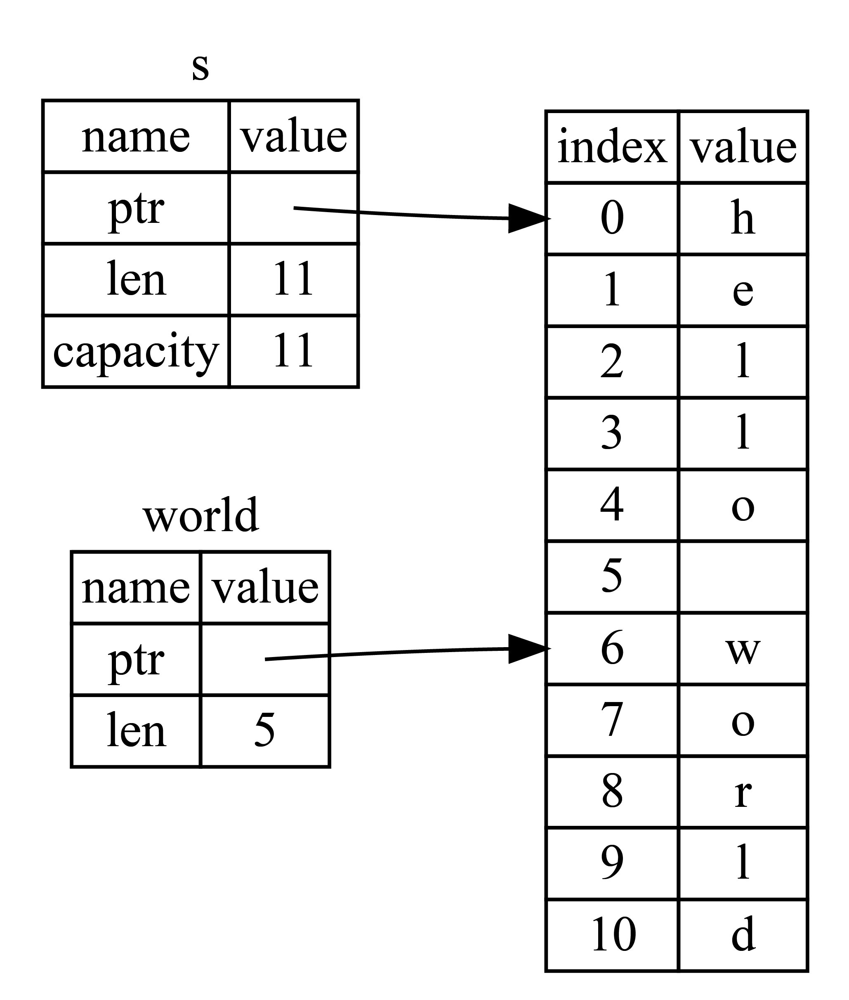

# 字符串

- [字符串](#字符串)
  - [1. 简介](#1-简介)
  - [2. 切片](#2-切片)
  - [3. 其它切片](#3-其它切片)
  - [4. 字符串字面量为切片](#4-字符串字面量为切片)
  - [5. 什么是字符串](#5-什么是字符串)
  - [6. String 与 \&str 的转换](#6-string-与-str-的转换)
  - [7. 字符串索引](#7-字符串索引)
    - [7.1. 深入字符串](#71-深入字符串)
    - [7.2. 字符串的不同形式](#72-字符串的不同形式)
  - [8. 字符串切片](#8-字符串切片)
  - [9. 操作字符串](#9-操作字符串)
    - [9.1. 追加](#91-追加)
    - [9.2. 插入](#92-插入)
    - [9.3. 替换](#93-替换)
    - [9.4. 删除](#94-删除)
    - [9.5. 连接](#95-连接)
  - [10. 字符串转义](#10-字符串转义)
  - [11. UTF-8 字符串操作](#11-utf-8-字符串操作)
    - [11.1. 字符](#111-字符)
    - [11.2. 字节](#112-字节)
    - [11.3. 获取子串](#113-获取子串)
  - [12. 字符串切片作为参数](#12-字符串切片作为参数)
  - [13. 更多示例](#13-更多示例)

2023-10-23, 13:51
@author Jiawei Mao
****

## 1. 简介

复合类型由其它类型组合而成，如结构体 `struct` 和枚举 `enum`。

字符串是一种复合类型，Rust 中字符串真的很复杂。例如：

```rust
fn main() {
    let my_name = "Pascal";
    greet(my_name);
}

fn greet(name: String) {
    println!("Hello, {}!", name);
}
```

`greet` 函数接受一个字符串类型的 `name` 参数，然后将其打印到控制台。然而，这段代码无法通过编译：

```sh
error[E0308]: mismatched types
 --> src/main.rs:3:11
  |
3 |     greet(my_name);
  |           ^^^^^^^
  |           |
  |           expected struct `std::string::String`, found `&str`
  |           help: try using a conversion method: `my_name.to_string()`
error: aborting due to previous error
```

编译器提示 `greet` 函数需要一个 `String` 类型的字符串，传入的却是一个 `&str`。

## 2. 切片

切片（slice）用来引用集合的一部分连续元素，而不是整个集合。**切片是一种引用**，因此它没有所有权。

字符串切片是对 `String` 一部分的引用，类似：

```rust
let s = String::from("hello world");

let hello = &s[0..5];
let world = &s[6..11];
```

这里 `hello` 是对字符串 `s` `[0..5]` 这一部分的引用。

切片范围通过 `[start_index..end_index]` 指定。

在内部，slice 存储切片的起始位置和长度。所以 `let world = &s[6..11];`，world 是一个长度为 5 的切片，指向 s 的索引 6。如下图所示：

{width="300px"}

- Rust 的 `..` 语法，如果索引从 0 开始，可以省掉 0

```rust
let s = String::from("hello");

let slice = &s[0..2];
let slice = &s[..2];
```

- 如果取到字符串末尾，也可以省略

```rust
let s = String::from("hello");

let len = s.len();

let slice = &s[3..len];
let slice = &s[3..];
```

- 如果切片整个字符串，起始和末尾索引值都不需要

```rust
let s = String::from("hello");

let len = s.len();

let slice = &s[0..len];
let slice = &s[..]; // 效果同上
```

!!! warning
    在 Rust 中对字符串切片需要格外小心，切片的索引必须落在字符之间的边界位置，即 UTF-8 字符边界。例如，中文在 UTF-8 中占用三个字节，下面的代码会 panic：

    ```rust
    let s = "中国人";
    let a = &s[0..2];
    println!("{}",a);
    ```
    这里只取 `s` 的前了两个字节，但是每个汉字占三个字节，导致`中`取不完整，程序崩溃；如果改成 `&s[0..3]` 则可以正常编译。因此对字符串做切片时要格外小心。

字符串切片的类型标识为 `&str`，下面根据切片编写 `first_word` 函数：

```rust
fn main() {
    let mut s = String::from("hello world");
    let word = first_word(&s);
    s.clear(); // error!
    println!("the first word is: {}", word);
}

fn first_word(s: &String) -> &str {
    &s[..1]
}
```

因为切片是对字符串的引用，编译器不允许在引用 scope 内清理字符串，否则报错：

```sh
$ cargo run
   Compiling ownership v0.1.0 (file:///projects/ownership)
error[E0502]: cannot borrow `s` as mutable because it is also borrowed as immutable
  --> src/main.rs:18:5
   |
16 |     let word = first_word(&s);
   |                           -- immutable borrow occurs here
17 |
18 |     s.clear(); // error!
   |     ^^^^^^^^^ mutable borrow occurs here
19 |
20 |     println!("the first word is: {}", word);
   |                                       ---- immutable borrow later used here
```

根据借用规则，如果我们有一个 immutable 引用，就不能同时创建一个可变引用。`clear` 需要清空 `String`，所以它需要可变引用。`println!` 在 `clear` 之后使用 `word` 引用，因此 immutable 引用在此必须依然有效。

## 3. 其它切片

切片是对集合的部分引用，因此不仅仅字符串有切片，其它集合类型也有。

- 数组切片

```rust
let a = [1, 2, 3, 4, 5];

let slice = &a[1..3];

assert_eq!(slice, &[2, 3]);
```

该切片类型为 `&[i32]`，其工作方式与字符串一样。

## 4. 字符串字面量为切片

字符串字面量存储在二进制文件中。例如：

```rust
let s = "Hello, world!";
```

这里 s 的 类型为 `&str`，因此也可以这样：

```rust
let s: &str = "Hello, world!";
```

字符串字面量切片 `s` 指向二进制文件中某个点。这也是字符串字面量是 immutable 的原因，`&str` 是 immutable 引用。

## 5. 什么是字符串

字符串是由字符组成的连续集合，Rust 中的字符是 Unicode 类型，因此**每个字符占据 4 个字节**内存空间。

但是在字符串中不一样，字符串是 UTF-8 编码，也就是字符串中的字符所占的字节数是变化的(1 - 4)，这样有助于大幅降低字符串所占用的内存空间。

Rust 在语言级别只有一种字符串类型： `str` ，它通常是以引用类型出现 `&str`，也就是上文提到的字符串切片。虽然语言级别只有 `str` 类型，但是在标准库里，还有多种不同用途的字符串类型，其中使用最广的是 `String` 类型。

`str` 类型是硬编码进可执行文件，也无法被修改，但是 `String` 则是一个可增长、可改变且具有所有权的 UTF-8 编码字符串，当 Rust 用户提到字符串时，往往指的就是 `String` 类型和 `&str` 字符串切片类型，这两个类型都是 UTF-8 编码。

除了 `String` 类型的字符串，Rust 的标准库还提供了其他类型的字符串，例如 `OsString`，`OsStr`， `CsString` 和 `CsStr` 等，注意到这些名字都以 `String` 或者 `Str` 结尾了吗？它们分别对应的是具有所有权和被借用的变量。

## 6. String 与 &str 的转换

其实我们已经见过几种从 `&str` 类型生成 `String` 类型的操作：

- `String::from("hello,world")`
- `"hello,world".to_string()`

将 `String` 转换为 `&str` 类型，取引用即可：

```rust
fn main() {
    let s = String::from("hello,world!");
    say_hello(&s);
    say_hello(&s[..]);
    say_hello(s.as_str());
}

fn say_hello(s: &str) {
    println!("{}",s);
}
```

## 7. 字符串索引

在其它语言中，使用索引的方式访问字符串的某个字符或者子串是很正常的行为，但是在 Rust 中就会报错：

```rust
fn main() {
    let s1 = String::from("hello");
    let h = s1[0];
}
```

```sh
3 |     let h = s1[0];
  |             ^^^^^ `String` cannot be indexed by `{integer}`
  |
  = help: the trait `Index<{integer}>` is not implemented for `String`
```

### 7.1. 深入字符串

字符串的底层的数据存储格式实际上是 `u8` 字节数组。对于 `let hello = String::from("Hola");` 这行代码来说， Hola 的长度是 4 个字节，因为 "Hola" 中的每个字母在UTF-8 编码中仅占用 1 个字节，但是对于下面的代码呢？

```rust
let hello = String::from("中国人");
```

该字符串长度为 9，大部分汉字在 UTF-8 中的长度是 3 个字节。此时对 `hello` 进行索引，访问 `&hello[0]` 没有任何意义，压根得不到 `中` 这个字符，而是取到这个字符三个字节中的第一个。

### 7.2. 字符串的不同形式

梵文 `“नम े”` 的底层字节数组形式：

```rust
[224, 164, 168, 224, 164, 174, 224, 164, 184, 224, 165, 141, 224, 164, 164, 224, 165, 135]
```

长度是 18 字节，这也是计算机最终存储形式。如果从字符的形式看，则是：

```rust
['न', 'म', 'स', '◌्', 'त', '◌े']
```

但是这种形式下，第四和六两个字母根本就不存在，没有任何意义，接着再从字母串的形式去看：

```rust
["न", "म", "स्", "ते"]
```

可以看出 Rust 提供了不同的字符串展现方式，程序可以挑选自己想要的方式去使用，而无需去管字符串从人类语言角度看长什么样。

还有一个原因导致了 Rust 不允许去索引字符串：因为索引操作，我们总是期望它的性能表现是 O(1)，然而 `String` 类型无法保证这一点，因为 Rust 可能需要从 0 开始遍历字符串来定位合法的字符。

## 8. 字符串切片

字符串切片是非常危险的操作，因为你无法保证索引的字节刚好落在字符的边界，例如：

```rust
let hello = "中国人";

let s = &hello[0..2];
```

运行该程序，会直接 panic:

```sh
thread 'main' panicked at 'byte index 2 is not a char boundary; it is inside '中' 
(bytes 0..3) of `中国人`', src/main.rs:4:14
note: run with `RUST_BACKTRACE=1` environment variable to display a backtrace
```

## 9. 操作字符串

由于 String 是可变字符串，因此支持修改、添加、删除等操作。

### 9.1. 追加

追加操作：

- 使用 `push()` 追加字符 `char`
- 使用 `push_str()` 追加字符串字面量

这两个方法都是在原有字符串上追加，不会返回新的字符串。

因为字符串追加操作要修改原来的字符串，因此该字符串**必须是可变的**。

```rust
fn main() {
    let mut s = String::from("Hello ");

    s.push_str("rust");
    println!("追加字符串 push_str() -> {}", s);
    
    s.push('!');
    println!("追加字符 push() -> {}", s);
}
```

```sh
追加字符串 push_str() -> Hello rust
追加字符 push() -> Hello rust!
```

### 9.2. 插入

插入操作：

- 使用 insert() 插入单个字符 char
- 使用 insert_str() 插入字符串字面量

与 `push()` 方法 不同，这两个方法需要传入两个参数：

1. 字符（串）插入位置的索引，索引从 0 开始，越界则发生错误
2. 要插入的字符（串）

插入也要修改原字符串，所以字符串必须可修改。

**示例：**

```rust
fn main() {
    let mut s = String::from("Hello rust!");

    s.insert(5, ',');
    println!("插入字符 insert() -> {}", s);

    s.insert_str(6, " I like");
    println!("插入字符串 insert_str() -> {}", s);
}
```

```sh
插入字符 insert() -> Hello, rust!
插入字符串 insert_str() -> Hello, I like rust!
```

### 9.3. 替换

与替换相关的方法有三个：

1. `replace`

该方法适用于 `String` 和 `&str` 类型。 `replace()` 方法接收两个参数：

- 要被替换的字符串
- 新的字符串

该方法会替换所有匹配到的字符串，返回一个新的字符串，而不是操作原来的字符串。

**示例：**

```rust
fn main() {
    let string_replace = String::from("I like rust. Learning rust is my favorite!");
    let new_string_replace = string_replace.replace("rust", "RUST");
    dbg!(new_string_replace);
}
```

```sh
new_string_replace = "I like RUST. Learning RUST is my favorite!"
```

2. `replacen`

该方法适用于 `String` 和 `&str` 类型，接收三个参数，前两个参数与 `replace()` 一样，第三个参数表示替换的个数。该方法是返回一个新的字符串。

**示例：**

```rust
fn main() {
    let string_replace = "I like rust. Learning rust is my favorite!";
    let new_string_replacen = string_replace.replacen("rust", "RUST", 1);
    dbg!(new_string_replacen);
}
```

```sh
new_string_replacen = "I like RUST. Learning rust is my favorite!"
```

3. `replace_range`

该方法仅适用于 `String` 类型，接收两个参数:

- 要替换字符串的范围（Range）
- 新的字符串

该方法是直接操作原来的字符串，不会返回新的字符串。该方法需要使用 `mut` 关键字修饰。

```rust
fn main() {
    let mut string_replace_range = String::from("I like rust!");
    string_replace_range.replace_range(7..8, "R");
    dbg!(string_replace_range);
}
```

```sh
string_replace_range = "I like Rust!"
```

### 9.4. 删除

与字符串删除相关的方法有 4 个，分别是 `pop()`，`remove()`， `truncate()`， `clear()` 。这四
个方法仅适用于 `String` 类型。

1. `pop`：删除并返回字符串的最后一个字符

该方法直接操作原来的字符串。同时返回一个 `Option` 类型，如果字符串为空，则返回 `None`。

**示例：**

```rust
fn main() {
    let mut string_pop = String::from("rust pop 中文!");
    let p1 = string_pop.pop();
    let p2 = string_pop.pop();
    dbg!(p1);
    dbg!(p2);
    dbg!(string_pop);
}
```

```sh
p1 = Some(
   '!',
)
p2 = Some(
   '文',
)
string_pop = "rust pop 中"
```

2. `remove`：删除并返回字符串中指定位置的字符

该方法直接操作原来的字符串，同时返回删除位置的字符。只接收一个参数，表示该字符起始索引位置。

`remove()` 方法按照字节来处理字符串的，如果参数所给的位置不是合法的字符边界，则会发生错误。

**示例：**

```rust
fn main() {
    let mut string_remove = String::from("测试remove方法");
    println!(
        "string_remove 占 {} 个字节",
        std::mem::size_of_val(string_remove.as_str())
    );
    // 删除第一个汉字
    string_remove.remove(0);
    // 下面代码会发生错误
    // string_remove.remove(1);
    // 直接删除第二个汉字
    // string_remove.remove(3);
    dbg!(string_remove);
}
```

```sh
string_remove 占 18 个字节
string_remove = "试remove方法"
```

3. `truncate`：删除字符串中从指定位置开始到结尾的全部字符

该方法直接操作原来的字符串，无返回值。`truncate()` 按照字节来处理字符串，如果参数所给的位置不是合法的字符边界，会发生错误。

**示例**：

```rust
fn main() {
    let mut string_truncate = String::from("测试truncate");
    string_truncate.truncate(3);
    dbg!(string_truncate);
}
```

```sh
string_truncate = "测"
```

4. `clear`：清空字符串

`clear` 操作原来的字符串，删除字符串中的所有字符，相当于 `truncate()` 方法参数为 0 的时候。

**示例：**

```rust
fn main() {
    let mut string_clear = String::from("string clear");
    string_clear.clear();
    dbg!(string_clear);
}
```

```sh
string_clear = ""
```

### 9.5. 连接

1. 使用 `+` 或者 `+=` 连接字符串

使用 `+` 或者 `+=` 连接字符串，要求右边的参数必须为字符串的**切片引用**（Slice）类型。

其实调用 `+` 相当于调用 `std::string::add()` 方法，`add()` 的第二个参数是引用类型。因此在使用 `+` 时必须传递切片引用类型。不能直接传递 `String` 类型。

`+` 返回一个新的字符串，所以变量声明不需要 `mut` 关键字修饰。

**示例：**

```rust
fn main() {
    let string_append = String::from("hello ");
    let string_rust = String::from("rust");
    // &string_rust会自动解引用为&str
    let result = string_append + &string_rust;
    let mut result = result + "!"; // `result + "!"` 中的 `result` 是不可变的
    result += "!!!";
    println!("连接字符串 + -> {}", result);
}
```

```sh
连接字符串 + -> hello rust!!!!
```

`add()` 方法的定义：

```rust
fn add(self, s: &str) -> String
```

`self` 是 String 类型的字符串，接收 `&str` 类型参数，返回 `String` 值。

该方法涉及更复杂的功能，这里做简单说明：

```rust
fn main() {
    let s1 = String::from("hello,");
    let s2 = String::from("world!");
    
    // 在下句中，s1 的所有权被转移走了，因此后面不能再使用 s1
    let s3 = s1 + &s2;
    assert_eq!(s3,"hello,world!");
    // 下面的语句如果去掉注释，就会报错
    // println!("{}",s1);
}
```

2. 使用 `format!` 连接字符串

`format!` 适用于 `String` 和` &str`，其用于与 `print!` 类似。

**示例：**

```rust
fn main() {
    let s1 = "hello";
    let s2 = String::from("rust");
    let s = format!("{} {}!", s1, s2);
    println!("{}", s);
}
```

```sh
hello rust!
```

## 10. 字符串转义

可以通过转义的方式 \ 输出 ASCII 和 Unicode 字符：

```rust
fn main() {
    // 通过 \ + 字符的十六进制表示，转义输出一个字符
    let byte_escape = "I'm writing \x52\x75\x73\x74!";
    println!("What are you doing\x3F (\\x3F means ?) {}", byte_escape);
    // \u 可以输出一个 unicode 字符
    let unicode_codepoint = "\u{211D}";
    let character_name = "\"DOUBLE-STRUCK CAPITAL R\"";
    println!(
        "Unicode character {} (U+211D) is called {}",
        unicode_codepoint, character_name
    );
    // 换行了也会保持之前的字符串格式
    // 使用\忽略换行符
    let long_string = "String literals
                        can span multiple lines.
                        The linebreak and indentation here ->\
                        <- can be escaped too!";
    println!("{}", long_string);
}
```

```sh
What are you doing? (\x3F means ?) I'm writing Rust!
Unicode character ℝ (U+211D) is called "DOUBLE-STRUCK CAPITAL R"
String literals
                        can span multiple lines.
                        The linebreak and indentation here -><- can be escaped too!
```

不用转义：

```sh
fn main() {
    println!("{}", "hello \\x52\\x75\\x73\\x74");
    let raw_str = r"Escapes don't work here: \x3F \u{211D}";
    println!("{}", raw_str);
    // 如果字符串包含双引号，可以在开头和结尾加 #
    let quotes = r#"And then I said: "There is no escape!""#;
    println!("{}", quotes);
    // 如果还是有歧义，可以继续增加，没有限制
    let longer_delimiter = r###"A string with "# in it. And even "##!"###;
    println!("{}", longer_delimiter);
}
```

```sh
hello \x52\x75\x73\x74
Escapes don't work here: \x3F \u{211D}
And then I said: "There is no escape!"
A string with "# in it. And even "##!
```

## 11. UTF-8 字符串操作

### 11.1. 字符

使用 `chars` 方法遍历字符串的 Unicode 字符：

```rust
for c in "中国人".chars() {
    println!("{}", c);
}
```

```sh
中
国
人
```

### 11.2. 字节

使用 `bytes()` 遍历字符串底层字节数组：

```rust
fn main() {
    for b in "中国人".bytes() {
        println!("{}", b);
    }
}
```

```sh
228
184
173
229
155
189
228
186
186
```

### 11.3. 获取子串

从 UTF-8 字符串中获取子串较为复杂。可以考虑使用 `utf8_slice` 库。

## 12. 字符串切片作为参数

了解字面量和字符串切片后，我们继续对 first_word 进行改进，其签名如下：

```rust
fn first_word(s: &String) -> &str {
```

更好的方式是使用 &str 作为参数：

```rust
fn first_word(s: &str) -> &str {
```

对字符串切片，可以直接传入函数；对字符串，可以传递该字符串的切片或引用。该灵活性利用了 deref 强制转换。

定义一个接受字符串切片而不是字符串引用的函数，可以让 API 更通用，同时不会失去任何功能：

```rust
fn main() {
    let my_string = String::from("hello world");

    // `first_word` works on slices of `String`s, whether partial or whole
    let word = first_word(&my_string[0..6]);
    let word = first_word(&my_string[..]);
    // `first_word` also works on references to `String`s, which are equivalent
    // to whole slices of `String`s
    let word = first_word(&my_string);

    let my_string_literal = "hello world";

    // `first_word` works on slices of string literals, whether partial or whole
    let word = first_word(&my_string_literal[0..6]);
    let word = first_word(&my_string_literal[..]);

    // Because string literals *are* string slices already,
    // this works too, without the slice syntax!
    let word = first_word(my_string_literal);
}
```

## 13. 更多示例

- & 可以将 `Box<str>` 转换为 `&str`

```rust
fn main() {
    let s: Box<str> = "hello, world".into();
    greetings(&s) // 转换参数
}

fn greetings(s: &str) {
    println!("{}", s)
}
```

- 新建空 String

```rust
fn main() {
    let mut s = String::new();
    s.push_str("hello, world");
    s.push('!');
 
    assert_eq!(s, "hello, world!");
 }
```

