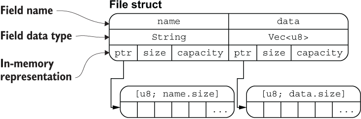

# 结构体

- [结构体](#结构体)
  - [简介](#简介)
  - [语法](#语法)
    - [定义 struct](#定义-struct)
    - [创建实例](#创建实例)
    - [访问字段](#访问字段)
    - [简化创建方式](#简化创建方式)
    - [更新结构体](#更新结构体)
  - [结构体内存结构](#结构体内存结构)
  - [元组结构体](#元组结构体)
  - [单元结构体](#单元结构体)
    - [结构体数据所有权](#结构体数据所有权)
  - [derive(Debug) 打印结构体](#derivedebug-打印结构体)
    - [dbg 宏](#dbg-宏)

2023-10-23, 15:55
@author Jiawei Mao
****

## 简介

结构体（struct）是一种自定义数据类型，可以将多个相关值打包在一起。struct 类似面向对象语言中的对象属性。

struct 类似元组，由多种类型组合而成；与元祖不同的时，struct 的每条数据具有名称。

## 语法

### 定义 struct

结构体由几部分组成：

- `struct` 关键字
- 一个结构体名称
- 多个具有名称的字段

示例：

```rust
struct User {
    active: bool,
    username: String,
    email: String,
    sign_in_count: u64,
}
```

这里，结构体名称为 `User`，包含 4 个字段，每个字段都有类型和名称。

### 创建实例

```rust
fn main() {
    let user1 = User {
        active: true,
        username: String::from("someusername123"),
        email: String::from("someone@example.com"),
        sign_in_count: 1,
    };
}
```

实例化要点：

- 初始化实例时，每个字段都需要初始化
- 字段顺序不重要，即不需要与结构定义的顺序一样

### 访问字段

struct 字段通过点号 `.` 访问，例如 `user1.email`。也可以通过该方式修改字段：

```rust
let mut user1 = User {
    email: String::from("someone@example.com"),
    username: String::from("someusername123"),
    active: true,
    sign_in_count: 1,
};

user1.email = String::from("anotheremail@example.com");
```

需要注意的是，必须将结构体声明为 `mut`，才能修改其字段值。

Rust 不支持将结构体的某个字段标记为 `mut`。

### 简化创建方式

- 下面的函数创建并返回 User 结构体

```rust
fn build_user(email: String, username: String) -> User {
    User {
        email: email,
        username: username,
        active: true,
        sign_in_count: 1,
    }
}
```

- 当函数参数和结构体字段同名，可以使用缩略方式

```rust
fn build_user(email: String, username: String) -> User {
    User {
        email,
        username,
        active: true,
        sign_in_count: 1,
    }
}
```

### 更新结构体

使用已有 struct 创建新的 struct。

- 直觉方式

```rust
let user2 = User {
    active: user1.active,
    username: user1.username,
    email: String::from("another@example.com"),
    sign_in_count: user1.sign_in_count,
};
```

- 更新语法

```rust
let user2 = User {
    email: String::from("another@example.com"),
    ..user1
};
```

`..user1` 表示没有显式声明的字段，全部从 `user1` 自动获取。必须在结构体**尾部**使用。

!!! note
    结构体更新语法与赋值 `=` 类似，在上面的代码中，`user1` 的部分字段所有权被转移到 `user2`，即 `username` 字段的所有权发生转移，因此 `user1` 无法继续使用。

    为何三个字段进行了自动赋值，只有 `username` 发生了所有权转移？

    因为实现了 `Copy` 特征的类型无需所有权转移，在赋值时直接拷贝数据，`bool` 和 `u64` 都实现了 `Copy` 特征，因此 `active` 和 `sign_in_count` 字段在赋值给 `user2` 时，仅仅发生了拷贝，而不是所有权转移。

user1 的 username 所有权转移给 user2，导致 user1 无法继续使用，但是不影响 user1 内部其它字段的使用。例如：

```rust
struct User {
    active: bool,
    username: String,
    email: String,
    sign_in_count: u64,
}

fn main() {
    let user1 = User {
        email: String::from("someone@example.com"),
        username: String::from("someusername123"),
        active: true,
        sign_in_count: 1,
    };
    let user2 = User {
        active: user1.active,
        username: user1.username,
        email: String::from("another@example.com"),
        sign_in_count: user1.sign_in_count,
    };
    println!("{}", user1.active);
    // 下面这行会报错
    //     println!("{:?}", user1);
}
```

## 结构体内存结构

示例代码：

```rust
#[derive(Debug)]
struct File {
    name: String,
    data: Vec<u8>,
}

fn main() {
    let f1 = File {
        name: String::from("f1.txt"),
        data: Vec::new(),
    };

    let f1_name = &f1.name;
    let f1_length = &f1.data.len();

    println!("{:?}", f1);
    println!("{} is {} bytes long", f1_name, f1_length);
}
```

其中 `File` 结构体在内存中的排列方式如下图所示：

{width="450px"}


可以看出，`File` 结构体的两个字段 name 和 data 分别拥有底层两个 `[u8]` 数组的所有权，通过 `ptr` 指针指向底层数组的内存地址。

## 元组结构体

结构体必须要有名称，但是结构体的字段可以没有名称，这种结构体长得像元组，因此被称为**元组结构体**。例如：

```rust
struct Color(i32, i32, i32);
struct Point(i32, i32, i32);

let black = Color(0, 0, 0);
let origin = Point(0, 0, 0);
```

## 单元结构体

单元结构体和单元类型类似，没有任何字段和属性，但是它也有用处。

如果你定义一个类型，不关心该类型的内容，只关心它的行为时，可以使用单元结构体：

```rust
struct AlwaysEqual;

let subject = AlwaysEqual;

// 我们不关心 AlwaysEqual 的字段数据，只关心它的行为
// 因此将它声明为单元结构体，然后再为它实现某个特征
impl SomeTrait for AlwaysEqual {

}
```

### 结构体数据所有权

在之前的 `User` 结构体的定义中，我们使用了自身拥有所有权的 `String` 类型而不是基于引用的 `&str` 字符串切片类型。因为我们想要这个结构体拥有它所有的数据，而不是从其它地方借用数据。

也可以让 `User` 结构体从其它对象借用数据，不过这么做，就需要引入生命周期(lifetimes)这个概念，生命周期能确保结构体的作用范围要比它所借用的数据的作用范围要小。

总之，如果想在结构体中使用一个引用，就必须加上生命周期，否则就会报错：

```rust
struct User {
    username: &str,
    email: &str,
    sign_in_count: u64,
    active: bool,
}
fn main() {
    let user1 = User {
        email: "someone@example.com",
        username: "someusername123",
        active: true,
        sign_in_count: 1,
    };
}
```

```sh
error[E0106]: missing lifetime specifier
 --> src/main.rs:2:15
  |
2 |     username: &str,
  |               ^ expected named lifetime parameter // 需要一个生命周期
  |
help: consider introducing a named lifetime parameter // 考虑像下面的代码这样引入一个生
命周期
  |
1 ~ struct User<'a> {
2 ~     username: &'a str,
  |
error[E0106]: missing lifetime specifier
 --> src/main.rs:3:12
  |
3 |     email: &str,
  |            ^ expected named lifetime parameter
  |
help: consider introducing a named lifetime parameter
  |
1 ~ struct User<'a> {
2 |     username: &str,
3 ~     email: &'a str,
  |
```

后面会介绍生命周期。

## derive(Debug) 打印结构体

结构体默认没有实现 Display，无法用 `println!`。

Rust 默认不会实现 `Debug`，有两种实现方式：

- 手动实现
- 使用 `derive` 派生

`derive` 有限制，但是简单许多。使用方式：

```rust
#[derive(Debug)]
struct Rectangle {
    width: u32,
    height: u32,
}
fn main() {
    let rect1 = Rectangle {
        width: 30,
        height: 50,
    };
    println!("rect1 is {:?}", rect1);
}
```

- 即用 `derive` 派生后，可以用 `{:?}` 来打印结构体。
- 用 `{:#?}` 代替 `{:?}` 可以生成更美观的输出。

### dbg 宏

dbg! 宏拿走表达式的所有权，然后打印相应的文件名，行号等 debug 信息，以及表达式的结果。最好把表达式值的所有权返回。

!!! note
    dbg! 输出到标准错误，println! 输出到标准输出。

示例：

```rust
#[derive(Debug)]
struct Rectangle {
    width: u32,
    height: u32,
}
fn main() {
    let scale = 2;
    let rect1 = Rectangle {
        width: dbg!(30 * scale),
        height: 50,
    };
    dbg!(&rect1);
}
```

```sh
$ cargo run
[src/main.rs:10] 30 * scale = 60
[src/main.rs:14] &rect1 = Rectangle {
    width: 60,
    height: 50,
}
```

