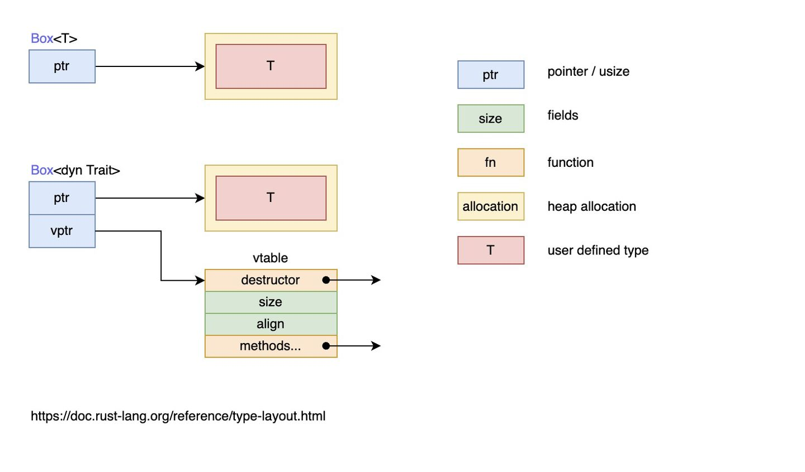

# 特征对象

- [特征对象](#特征对象)
  - [简介](#简介)
  - [定义特征对象](#定义特征对象)
  - [动态分发](#动态分发)
  - [Self 和 self](#self-和-self)
  - [特征对象的限制](#特征对象的限制)

2023-10-26, 16:35
@author Jiawei Mao
****

## 简介

在上一章有一段代码无法通过编译:

```rust
fn returns_summarizable(switch: bool) -> impl Summary {
    if switch {
        Post {
           // ...
        }
    } else {
        Weibo {
            // ...
        }
    }
}
```

其中 `Post` 和 `Weibo` 都实现了 `Summary` 特征，因此上面的函数试图通过返回 `impl Summary` 来返回这两个类型，但是编译器却报错了，原因是 `impl Trait` 的返回值类型并不支持多种不同的类型返回，那如果我们想返回多种类型，该怎么办？

再来考虑一个问题：将多个对象渲染在屏幕上，这些对象属于不同的类型，存储在列表中，渲染的时候，需要循环该列表渲染每个对象，在 Rust 中该怎么实现？

可以利用枚举：

```rust
#[derive(Debug)]
enum UiObject {
    Button,
    SelectBox,
}

fn main() {
    let objects = [
        UiObject::Button,
        UiObject::SelectBox
    ];

    for o in objects {
        draw(o)
    }
}

fn draw(o: UiObject) {
    println!("{:?}",o);
}
```

这确实是一个办法，但是如果你的对象集合并不能事先明确地知道呢？或者别人想要实现一个 UI 组件呢？此时枚举中的类型是缺失的，是不是还要修改你的代码增加一个枚举成员？

总之，在编写这个 UI 库时，无法知道所有的 `UI` 对象类型，只知道：

- UI 对象的类型不同
- 需要一个统一的类型来处理这些对象，无论是作为函数参数还是作为列表中的一员
- 需要对每一个对象调用 `draw` 方法

在拥有继承的语言中，可以定义一个名为 `Component` 的类，该类上有一个 `draw` 方法。其他的类比如 `Button` 、 `Image` 和 `SelectBox` 从 `Component` 派生并继承 `draw` 方法。它们各自覆盖 `draw` 方法来定义自己的行为，但是框架会把所有这些类型当作是 `Component` 的实例，并在其上调用 `draw` 。然而 Rust 并没有继承。

## 定义特征对象

在介绍特征对象之前，先为之前的 `UI` 组件定义一个特征：

```rust
pub trait Draw {
    fn draw(&self);
}
```

只要组件实现了 `Draw` 特征，就可以调用 `draw` 方法来进行渲染。假设有一个 `Button` 和 `SelectBox` 组件实现了 `Draw` 特征：

```rust
pub struct Button {
    pub width: u32,
    pub height: u32,
    pub label: String,
}

impl Draw for Button {
    fn draw(&self) {
        // 绘制按钮的代码
    }
}

struct SelectBox {
    width: u32,
    height: u32,
    options: Vec<String>,
}

impl Draw for SelectBox {
    fn draw(&self) {
        // 绘制SelectBox的代码
    }
}
```

此时，还需要一个动态数组来存储这些 UI 对象：

```rust
pub struct Screen {
    pub components: Vec<?>,
}
```

上面代码中的 `?` 应该填入什么类型？

**特征对象**指向实现了 `Draw` 特征类型的实例，也就是指向了 `Button` 或者 `SelectBox` 的实例，这种映射关系是存储在一张表中，可以在运行时通过特征对象找到具体调用的类型方法。

可以通过 `&` 引用或者 `Box<T>` 智能指针的方式来**创建特征对象**。

```rust
trait Draw {
    fn draw(&self) -> String;
}

impl Draw for u8 {
    fn draw(&self) -> String {
        format!("u8: {}", *self)
    }
}

impl Draw for f64 {
    fn draw(&self) -> String {
        format!("f64: {}", *self)
    }
}

// 若 T 实现了 Draw 特征， 则调用该函数时传入的 Box<T> 可以被隐式转换成函数参数签名中的 Box<dyn Draw>
fn draw1(x: Box<dyn Draw>) {
    // 由于实现了 Deref 特征，Box 智能指针会自动解引用为它所包裹的值，然后调用该值对应的类型上定义的 `draw` 方法
    x.draw();
}

fn draw2(x: &dyn Draw) {
    x.draw();
}

fn main() {
    let x = 1.1f64;
    // do_something(&x);
    let y = 8u8;

    // x 和 y 的类型 T 都实现了 `Draw` 特征，因为 Box<T> 可以在函数调用时隐式地被转换为特征对象 Box<dyn Draw> 
    // 基于 x 的值创建一个 Box<f64> 类型的智能指针，指针指向的数据被放置在了堆上
    draw1(Box::new(x));
    // 基于 y 的值创建一个 Box<u8> 类型的智能指针
    draw1(Box::new(y));
    draw2(&x);
    draw2(&y);
}
```

说明：

- `draw1` 的参数是 `Box<dyn Draw>` 形式的特征对象，该特征对象通过 `Box::new(x)` 的方式创建
- `draw2` 的参数是 `&dyn Draw` 形式的特征对象，该特征对象是通过 `&x` 的方式创建
- `dyn` 关键字只用在特征对象的类型声明上，在创建时无需使用 `dyn`

继续来完善之前的 UI 组件代码，首先实现 `Screen` ：

```rust
pub struct Screen {
    pub components: Vec<Box<dyn Draw>>,
}
```

其中动态数组的元素类型是 `Draw` 特征对象 `Box<dyn Draw>`，任何实现了 `Draw` 特征的类型，都可以存放其中。

再来为 `Screen` 定义 `run` 方法，用于将列表中的 UI 组件渲染在屏幕上：

```rust
impl Screen {
    pub fn run(&self) {
        for component in self.components.iter() {
            component.draw();
        }
    }
}
```

至此，我们就完成了之前的目标：在列表中存储多种不同类型的实例，然后将它们使用同一个方法逐一渲染在屏幕上！

再来看看，如果通过泛型实现，会如何：

```rust
pub struct Screen<T: Draw> {
    pub components: Vec<T>,
}

impl<T> Screen<T>
    where T: Draw {
    pub fn run(&self) {
        for component in self.components.iter() {
            component.draw();
        }
    }
}
```

上面 `Screen` 列表中，存储了类型为 `T` 的元素，然后在 `Screen` 中使用特征约束让 `T` 实现 `Draw` 特征，进而可以调用 `draw` 方法。

但是这种写法限制了 `Screen` 实例的 `Vec<T>` 中的每个元素必须是 `Button` 类型或者全是 `SelectBox` 类型。如果只需要同质（相同类型）集合，更倾向于采用泛型+特征约束这种写法，因其实现更清晰，且性能更好(特征对象，需要在运行时从 `vtable` 动态查找需要调用的方法)。

现在来运行渲染下咱们精心设计的 UI 组件列表：

```rust
fn main() {
    let screen = Screen {
        components: vec![
            Box::new(SelectBox {
                width: 75,
                height: 10,
                options: vec![
                    String::from("Yes"),
                    String::from("Maybe"),
                    String::from("No")
                ],
            }),
            Box::new(Button {
                width: 50,
                height: 10,
                label: String::from("OK"),
            }),
        ],
    };

    screen.run();
}
```

上面使用 `Box::new(T)` 创建了两个 `Box<dyn Draw>` 特征对象，如果以后还需要增加 UI 组件，那么让该组件实现 `Draw` 特征，则可以很轻松的将其渲染在屏幕上，甚至用户可以引入我们的库作为三方库，然后在自己的库中为自己的类型实现 `Draw` 特征，然后进行渲染。

!!! warning
    `dyn` 不能单独定义特征对象，例如下面的代码编译器会报错，因为特征对象可以是任意实现了某个特征的类型，编译器在编译期不知道该类型的大小，不同的类型大小是不同的。

而 `&dyn` 和 `Box<dyn>` 在编译期都是已知大小，所以可以用作特征对象的定义。

```rust
fn draw2(x: dyn Draw) {
    x.draw();
}
```

```sh
10 | fn draw2(x: dyn Draw) {
   |          ^ doesn't have a size known at compile-time
   |
   = help: the trait `Sized` is not implemented for `(dyn Draw + 'static)`
help: function arguments must have a statically known size, borrowed types always have a known size
```

## 动态分发

泛型在编译期完成：编译器为每个泛型参数对应的类型生成一份代码，这种方式称为**静态分发**（static dispatch）。静态分发在编译期完成，对运行性能没有任何影响。

与静态分发对应的是动态分发（dynamic dispatch）。动态分发在运行时才能确定需要调用的方法，`dyn` 关键字正是强调这一点。

使用特征对象就用到动态分发。Rust 在运行时使用特征对象的指针判断需要调用哪个方法。

下图解释静态分发 `Box<T>` 和动态分发 `Box<dyn Trait>` 的区别：

{width="800px"}

总结：

- **特征对象大小不固定**：例如，对特征 `Draw` ，类型 `Button` 可以实现特征 `Draw` ，类型 `SelectBox` 也可以实现特征 `Draw` ，因此特征没有固定大小
- 几乎总是使用特征对象的引用方式，如 `&dyn Draw`、`Box<dyn Draw>`
  - 虽然特征对象没有固定大小，但它的引用类型的大小是固定的，它由两个指针组成（ `ptr` 和 `vptr` ），因此占用两个指针大小
  - 指针 `ptr` 指向实现了特征 `Draw` 的具体实例，也就是当作特征 `Draw` 来用的类型的实例，比如类型 `Button` 的实例、类型 `SelectBox` 的实例
  - 指针 `vptr` 指向一个虚表 `vtable`，`vtable` 中保存了 `Button` 或 `SelectBox` 的实例对于可以调用的实现于特征 `Draw` 的方法。当调用方法时，直接从 `vtable` 中找到方法并调用。之所以要使用一个 vtable 来保存各实例的方法，是因为实现了特征 `Draw` 的类型有多种，这些类型拥有的方法各不相同，当将这些类型的实例都当作特征 `Draw` 来使用时(此时，它们全都看作是特征 `Draw` 类型的实例)，有必要区分这些实例各自有哪些方法可调用

简而言之，当类型 `Button` 实现了特征 `Draw` 时，类型 `Button` 的实例对象 `btn` 可以当作特征 `Draw` 的特征对象类型来使用， `btn` 中保存了作为特征对象的数据指针（指向类型 `Button` 的实例数据）和行为指针（指向 `vtable`）。

此时 `btn` 是 `Draw` 的特征对象实例，而不是具体类型 `Button` 的实例，而且 `btn` 的 `vtable` 只包含了实现自特征 `Draw` 的那些方法（比如 `draw` ），因此 `btn` 只能调用实现特征 `Draw` 的 `draw` 方法，而不能调用类型 `Button` 本身实现的方法和类型 `Button` 实现于其他特征的方法。也就是说，`btn` 是哪个特征对象的实例，它的 `vtable` 中就包含了该特征的方法。

## Self 和 self

在 Rust 中，有两个 self ，一个指代当前的实例对象，一个指代特征或者方法类型的别名：

```rust
trait Draw {
    fn draw(&self) -> Self;
}

#[derive(Clone)]
struct Button;
impl Draw for Button {
    fn draw(&self) -> Self {
        return self.clone()
    }
}

fn main() {
    let button = Button;
    let newb = button.draw();
}
```

上述代码中， `self` 指代当前的实例对象，也就是 `button.draw()` 中的 `button` 实例， `Self` 则指代的是 `Button` 类型。

## 特征对象的限制

只有对象安全的特征才能拥有特征对象。对象安全要求特征的所有方法满足：

- 方法的返回类型不能是 `Self`
- 方法没有任何泛型参数

因为有了特征对象就不需要知道实现该特征的具体类型是什么。如果特征方法返回具体的 `Self` 类型，但是特征对象不知道具体类型。

如果使用泛型参数，使用特征时泛型参数被具体类型参数替换，此具体类型变成了实现该特征类型的一部分。而当使用特征对象时其具体类型被抹去，故而无从得知放入泛型参数类型到底是什么。

标准库中的 `Clone` 特征就不符合对象安全的要求：

```rust
pub trait Clone {
    fn clone(&self) -> Self;
}
```

`clone` 方法返回 `Self` 类型，因此对象不安全。

`String` 类型实现了 `Clone` 特征，`String` 实例调用 `clone` 方法得到一个 `String` 实例。类似地，调用 `Vec<T>` 实例的 `clone` 方法得到一个 `Vec<T>` 实例。 clone 的签名需要知道什么类型会代替 `Self`，因为这是它的返回值。

如果违反对象安全，编译器会提示。例如，如果尝试使用之前的 `Screen` 结构体来存放实现了 `Clone` 特征的类型：

```rust
pub struct Screen {
    pub components: Vec<Box<dyn Clone>>,
}
```

```sh
error[E0038]: the trait `std::clone::Clone` cannot be made into an object
 --> src/lib.rs:2:5
  |
2 |     pub components: Vec<Box<dyn Clone>>,
  |     ^^^^^^^^^^^^^^^^^^^^^^^^^^^^^^^^^^^ the trait `std::clone::Clone`
  cannot be made into an object
  |
  = note: the trait cannot require that `Self : Sized`
```